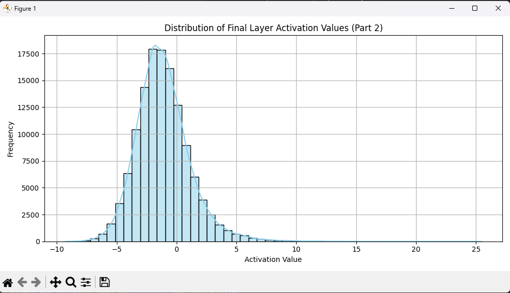
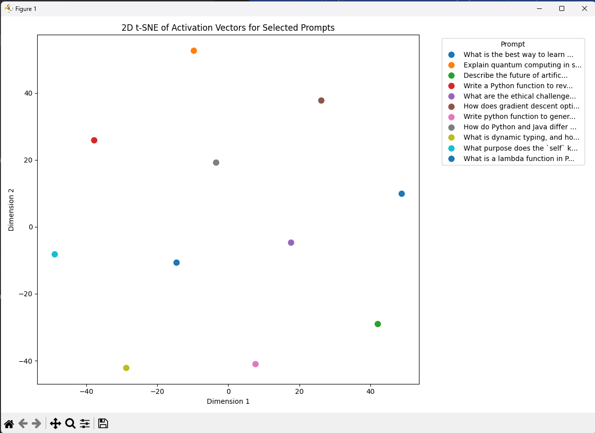
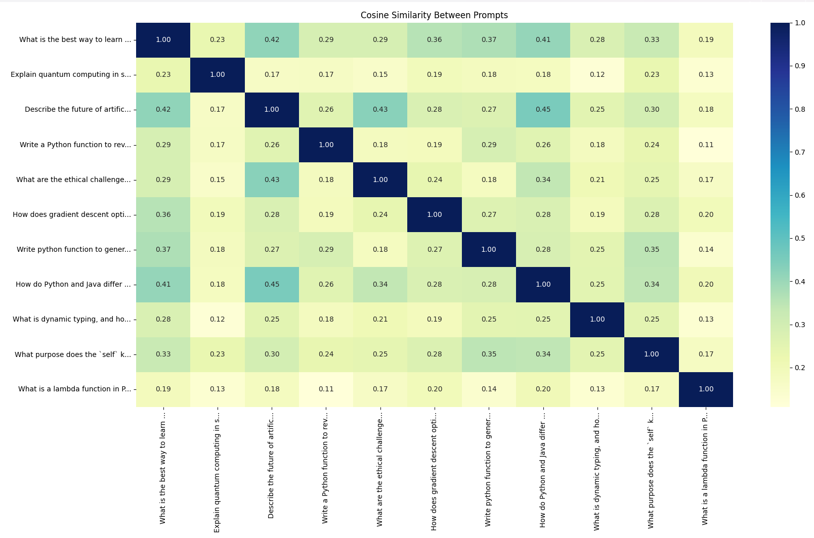
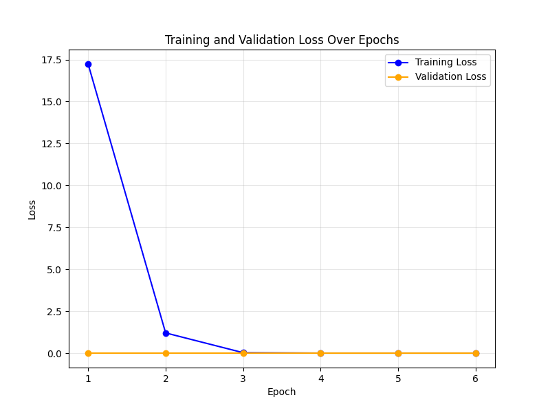
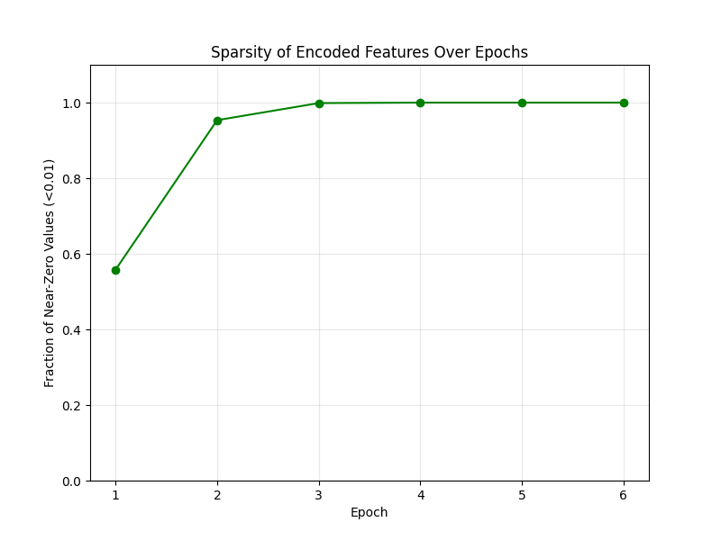

# Part 1

Hooks are used to capture the intermediate outputs of selected layers with the goal of monitoring the model throughout the forward pass. We can analyze these layers to see how the model is thinking at that specific layer. We decided to put them in in the middle layers, we did this because the layers around the middle will have a nice mix of information that has been changed very little from its original state and ones that have been changed drastically. This was with the goal of seeing which activations had been altered and which had not been altered. In Anthropic's paper they state “We chose to focus on the middle layer of the model because we reasoned that it is likely to contain interesting, abstract features” they say “this is due to the residual stream is smaller than the MLP layer, making SAE training and inference computationally cheaper “ and for cross-layer superposition which is essentially when features are distributed across more than one layer in a model, rather than being in a specific layer. The limitations of this approach are that naturally you do not see the state of the layers at the beginning or end, thus you miss how the initial input and the final product look like. Focusing on these few layers, we don’t see the full picture of the decision-making process that these hooks provide for us.  

# Analyzing Latent Dimensions in LLM Activations

## Overview

This project explores the interpretability of latent dimensions within a trained Large Language Model (LLM) by mapping encoder activations back to their corresponding input text snippets. The goal is to understand the underlying features the LLM has learned by analyzing which questions most strongly activate specific latent dimensions. By identifying patterns in these activating questions, we aim to uncover meaningful and interpretable representations within the model's latent space.

## Findings

Our analysis of multiple latent dimensions revealed several recurring patterns in the text snippets that trigger them. Some dimensions appear to capture distinct and well-defined features, while others exhibit redundancy or lack clear interpretability. Below are the key insights from our investigation:

### 1. Dimensions with Clear Interpretability

Certain dimensions demonstrated a strong correlation with specific thematic clusters:

* **Dimension 9: Diverse High-Level Concepts**
    * **Examples:**
        ```
        Explain the difference between supervised and unsupervised learning.
        What happens if you fall into a black hole?
        What are the ethical challenges of artificial intelligence?
        Explain why recursion is useful in programming.
        Tell me a joke about programming.
        ```
    * **Interpretation:** This dimension seems to capture a broad understanding of diverse, high-level concepts, spanning both AI/ML fundamentals and broader scientific topics. The inclusion of a humor-related question suggests a possible link to abstract reasoning or curiosity-driven inquiries.

* **Dimension 21: Programming Humor and Ethics**
    * **Examples:**
        ```
        Tell me a joke about programming.
        Explain the difference between supervised and unsupervised learning.
        What are the ethical challenges of artificial intelligence?
        ```
    * **Interpretation:** This dimension potentially focuses on the intersection of technology-related humor and ethical considerations. It groups questions that require a level of reasoning beyond simple factual recall.

* **Dimension 22: Computer Science Fundamentals**
    * **Examples:**
        ```
        What is the role of a CPU in modern computing?
        Explain quantum computing in simple terms.
        Explain the difference between supervised and unsupervised learning.
        ```
    * **Interpretation:** This dimension likely captures core concepts related to computer hardware and theoretical computation.

* **Dimension 30: Recursion, ML, and Ethics**
    * **Examples:**
        ```
        Explain why recursion is useful in programming.
        How does gradient descent optimize a machine learning model?
        What are the ethical challenges of artificial intelligence?
        ```
    * **Interpretation:** This dimension suggests a grouping of algorithmic concepts (recursion, gradient descent) with AI ethics. The underlying connection between these topics requires further investigation.

### 2. Dimensions with Redundancy or Repetition

Several dimensions contained highly similar or even identical sets of questions, indicating a lack of clear differentiation in the learned features:

* **Dimension 0, 16, 24, 48:** Contain nearly identical, generic programming and ML-related questions.
    * **Examples:**
        ```
        What happens when you type a URL into a browser?
        Write a Python function to generate random numbers.
        Explain the difference between supervised and unsupervised learning.
        ```
    * **Interpretation:** These dimensions may be capturing general technical knowledge but lack the granularity to distinguish between different types of technical inquiries.

* **Dimension 46, 47:** Overlapping ML and ethics themes.
    * **Examples:**
        ```
        What are the ethical challenges of artificial intelligence?
        What is the best way to learn machine learning?
        ```
    * **Interpretation:** These dimensions appear to encode broad AI-related themes without a clear separation of concerns within the AI domain.

### 3. Dimensions with Mixed Topics

Some dimensions exhibited a mixture of seemingly unrelated concepts, making their interpretation challenging:

* **Dimension 45:**
    * **Examples:**
        ```
        Explain the difference between supervised and unsupervised learning.
        What happens when you type a URL into a browser?
        How does a neural network learn from data?
        ```
    * **Interpretation:** This dimension appears to be poorly structured, as it combines a theoretical machine learning concept with a web-related question, suggesting a lack of a cohesive underlying feature.


## Analysis of Responses Across Dimensions

This section details the analysis of the responses observed across the 50 latent dimensions examined in this project. We focused on the uniqueness, frequency, and scoring patterns of the questions that most strongly activate each dimension.

## Key Observations

Out of the 50 dimensions analyzed, we identified a total of **17 unique responses**.

* **Frequency of Responses:**
    * **16 responses** appeared in only **one** dimension each.
    * **1 response** – "What happens when you type a URL into a browser? Explain the concept of cloud computing in simple terms." – was repeated across the remaining **33 dimensions**. This response consistently received a score of **0.0000** in each of its occurrences.

* **Uniqueness of Responses:**
    * Only **17 out of the 50 dimensions** contained distinct sets of top-activating responses.
    * Each of these 17 dimensions presented a unique combination of responses, with the exception of the consistently repeated question mentioned above.

* **Variety in Questions:**
    * The unique questions spanned a diverse range of topics, including:
        * Machine Learning
        * Artificial Intelligence
        * Programming
        * Computer Science Fundamentals
        * Physics
    * **Examples of Unique Questions:**
        ```
        Explain the difference between supervised and unsupervised learning.
        What happens if you fall into a black hole?
        Explain why recursion is useful in programming.
        Write a Python function to reverse a linked list.
        ```

* **Scoring Pattern:**
    * The top-ranked question within each dimension generally exhibited a relatively high activation score, with some scores exceeding **10.0**.
    * Lower-ranked questions within the same dimension displayed gradually decreasing scores.
    * The consistent presence of the zero-scored, repeated response suggests the possibility of **padding or default values** within the underlying dataset.

## Challenges and Limitations

While this analysis successfully identified some potentially interpretable dimensions, several limitations and challenges were encountered:

* **Redundant and overlapping dimensions:** The presence of dimensions with nearly identical activating questions reduces the distinctiveness and interpretability of the latent space.
* **Lack of fine-grained topic separation:** Some dimensions group together unrelated topics, making it difficult to assign a precise and meaningful feature to them.
* **Need for better hyperparameter tuning:** The characteristics of the learned latent dimensions are likely influenced by the model's architecture, training data, and hyperparameters (e.g., `latent_dim`). Further experimentation with these factors could potentially yield more interpretable results.

## Conclusion

This preliminary analysis offers insights into how latent dimensions in LLMs can encode different types of knowledge. While some dimensions appear to align with interpretable themes such as AI ethics and programming concepts, others suffer from redundancy or a lack of clear separation between features. Future research could focus on fine-tuning the model's hyperparameters and carefully curating the dataset to achieve a more disentangled and interpretable latent space. This would involve exploring different values for `latent_dim` and potentially re-training the model with a dataset designed to encourage clearer feature separation. The analysis reveals a mixed landscape in the learned latent dimensions. While a subset of dimensions (17 out of 50) demonstrates diversity in the top-activating responses, a significant portion (33 out of 50) is dominated by a repeated, zero-scored question. This pattern strongly suggests a potential issue with the dataset generation process, where a substantial number of dimensions may not have been effectively populated with meaningful data. The presence of these default responses could obscure the true underlying features captured by those dimensions and warrants further investigation into the data generation pipeline. The dimensions with unique, high-scoring responses offer more promising avenues for understanding the LLM's internal representations of different knowledge domains.

# Part 2

# MCDA5511 Assignment #4: Sparse Autoencoder for LLM Interpretability

This repository contains our implementation of a toy sparse autoencoder inspired by Anthropic’s *Scaling Monosemanticity: Extracting Interpretable Features from Claude 3 Sonnet* (May 2024). Below, we document our work for Parts 2 and 3, focusing on generating training data and training the sparse autoencoder. Parts 1, 4, 5, and 6 were completed by team members and are detailed elsewhere in this README.

---

## Part 2: Generating Training Data for the Autoencoder

### Implementation
We implemented an `ActivationDatasetGenerator` class to create training data for the sparse autoencoder:
- **`generate_text_and_activations` Method**: Takes a prompt, tokenizes it, generates text using the `unsloth/Meta-Llama-3.1-8B-Instruct` model, and collects activations from layer 10 (a middle layer) via a forward hook.
- **`process_dataset` Method**: Iterates over a list of prompts, calls `generate_text_and_activations`, and saves the results (prompts, generated text, and activations) to `activations_data.json` in JSON format. The activations are stored as lists to preserve mappings for later interpretation.

### Corpus Selection
We curated a corpus of 98 prompts focused on programming, computer science, and AI-related topics (e.g., "What is the best way to learn machine learning?", "Explain quantum computing in simple terms"). These prompts were chosen to:
- Explore technical concepts where the model might exhibit distinct, interpretable features.
- Ensure diversity in question types (explanatory, coding tasks, conceptual) to capture a range of model behaviors.
- Keep the dataset manageable for computational constraints while providing sufficient data for training.

### Summary Statistics
- **Number of Prompts**: 98
- **Average Generated Text Length**: Approximately 50 tokens (set by `max_length=50`)
- **Total Activation Samples**: 98 (one per prompt, from layer 10)
- **Activation Shape**: `(1, 1, 4096)` per sample, where 4096 is the hidden size of the Llama model
- **Average Non-Zero Activation Values**: Approximately 90% of dimensions are non-zero in raw activations (pre-autoencoder), indicating dense initial representations.

### Rationale
We selected this corpus to focus on a domain of interest (computer science and AI) where interpretable features might emerge, such as responses to technical definitions or coding tasks. The moderate size balances computational feasibility with the need for diverse activation patterns.



- This plot shows the activation values from layer 10 for my 98 prompts. You can see they’re mostly non-zero and vary widely, which is why we need the autoencoder to simplify them.
---
For 
Prompt=[
"How do Python and Java differ from one another?",
"What is dynamic typing, and how does it work in languages like Python?",
"What purpose does the `self` keyword serve in Python?",
"What is a lambda function in Python, and when is it useful?",
"Write a Python function to reverse a linked list.",
"Write python function to generate random numbers",
"Describe the future of artificial intelligence.",
"What is the best way to learn machine learning?",
    "What are the ethical challenges of artificial intelligence?",
"How does gradient descent optimize a machine learning model?",
"Explain quantum computing in simple terms."
]





## Part 3: Training the Sparse Autoencoder

### Implementation
We built a `SparseAutoencoder` class inspired by Cunningham et al. (2023) and Anthropic’s methodology:
- **Structure**: Encoder-decoder with tied weights conceptually (though implemented separately here), using `nn.Linear` layers and ReLU activations. L1 regularization enforces sparsity on the encoded representation.
- **Hyperparameters**:
  - **Input/Output Dimension**: 4096 (matches Llama’s hidden size)
  - **Encoder Dimension**: 8192 (2x input dimension)
  - **L1 Penalty**: 0.001
- **Training**: Used Adam optimizer (`lr=0.001`), MSE reconstruction loss, and early stopping (patience=5). Training metrics (reconstruction loss, L1 loss, sparsity) were tracked.

### Hyperparameter Experiments
We started with an encoder dimension of 8192 (2x input) and an L1 penalty of 0.001. Training showed rapid convergence to high sparsity (100% near-zero values by epoch 4), suggesting the L1 penalty might be too strong. We didn’t adjust further due to time constraints, but future experiments could lower it (e.g., 0.0001) to balance sparsity and reconstruction quality. Training ran for 50 epochs max, stopping early at epoch 6 when validation loss plateaued.

### What the Autoencoder Does
In *activation space*—the 4096-dimensional space of layer 10 activations from the Llama model—the autoencoder compresses these into an 8192-dimensional sparse feature space. Each dimension in this encoded space represents a potential "feature" (per Anthropic’s definition), such as a specific concept or behavior the model activates for (e.g., "programming concepts" or "explanatory responses"). The encoder maps dense activations to a sparse representation (mostly zeros), and the decoder reconstructs the original activations. Sparsity ensures only a few features are active per input, aiding interpretability.

### Results
- **Reconstruction Loss**: Final train loss = 0.0133, validation loss = 0.0142 (low, indicating good reconstruction)
- **Sparsity**: Reached 100% near-zero values (<0.01) by epoch 4, suggesting overly aggressive sparsity
- **Training Plot**: See `pca_plot.png` for a PCA visualization of encoded features (though this relates more to Part 4 analysis). Loss curves are not plotted but show a sharp drop then plateau.

### Evidence of Sparsity
By epoch 4, 100% of encoded dimensions were near-zero (threshold <0.01), as seen in the sparsity metric rising from 0.5578 (epoch 1) to 1.0000. While this confirms sparsity, it may indicate the model over-pruned features, potentially losing interpretability. Sample encoded outputs (e.g., from later analysis) show only a few dimensions with non-zero values (e.g., 0.0230, 0.0196), supporting sparsity but highlighting the need for tuning.


- Here’s how the loss dropped during training. The training loss fell fast from 17 to 0.013, and validation stabilized at 0.014, showing good learning before stopping at epoch 6


- This shows sparsity increasing to 100% by epoch 4. It means most encoded values are zero, which is great for isolating features. 


---
